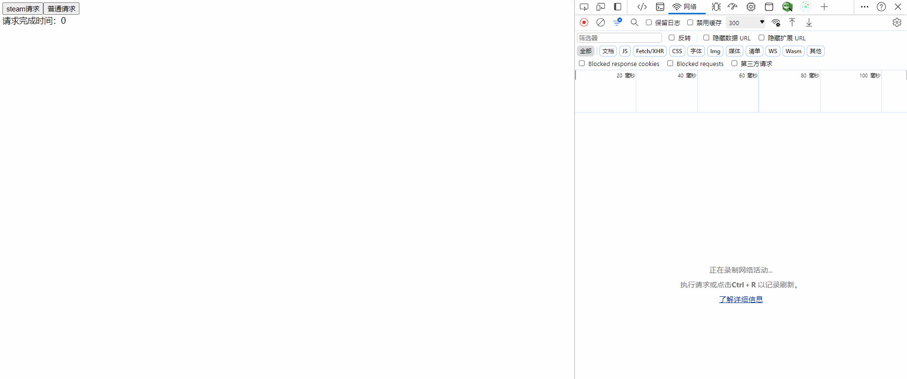

# stream-json-parse

> 针对网络接口的大json的返回。或者慢网速下。使用流式解析json。能够边下载边解析。让前端提前渲染部分数据。优化用户体验。
> 主要利用 fetch 流式传输，和 generate 的特性实现。


===================

例子：
后端返回的数据如下：

```js
{
  "code": 0,
  "data": [
    {
      "id": "64eb1b565c5214078f235c98",
      "email": "koch_pearson@isologics.global",
      "username": "koch90",

    },
    {
      "id": "64eb1b569f47412c27a74f11",
      "email": "norma_roman@blanet.caravan",
      "username": "norma89",
    },
    ...
  ]
}

```
如果data中数据很多，前端需要等待很久才能看到数据。这时候就可以使用stream-json-parse。边下载边解析。让前端提前渲染部分数据。
使用后，在回调函数中可以收到多次数据。(具体每次收到的数据需要根据每次网络包中的数据多少决定)

```js
// 第一次回调中收到：
{
  "code": 0,
  "data": [
    {
      "id": "64eb1b565c5214078f235c98",
      "email": "koch_pearson@isologics.global",
      "username": "koch90",

    },
  ]
}
// 第二次回调中收到：
{
  "code": 0,
  "data": [
    {
      "id": "64eb1b565c5214078f235c98",
      "email": "koch_pearson@isologics.global",
      "username": "koch90",

    },
    {
      "id": "64eb1b569f47412c27a74f11",
      "email": "norma_roman@blanet.caravan",
      "username": "norma89",
    },
  ]
}
```

===================

使用方法：

```js
import { fetchStreamJson, arrayItemSymbol } from 'stream-json-parse'

fetchStreamJson({
  // 请求地址
  url: './bigJson1.json',
  // 解析配置
  JSONParseOption: {
    // 要求完整解析对应路径下的数据，才能上报（可选）, arrayItemSymbol 表示数组项
    completeItemPath: ['data', arrayItemSymbol],
    // json解析的回调
    jsonCallback: (error, isDone, value) => {
      console.log('jsonCallback', error, isDone, value)
    },
    diffCallBack: (json, isEq) => {
      console.log('diffCallBack', json, isEq)
    }
  },
  // fetch请求配置，同浏览器 fetch api
  fetchOptions: {
    method: 'GET',
  },
})

```

参数说明：

- `url`: 请求地址
- `JSONParseOption`: 解析配置
  - `protoAction?: 'error' | 'ignore' | 'preserve';` // Object contains forbidden prototype property
  - `constructorAction?: 'error' | 'ignore' | 'preserve';` // Object contains forbidden constructor property
  - `strict?: boolean;` // 是否针对对象使用严格模式，不允许重复的key
  - `completeItemPath?: (string|symbol)[]`, // 要求完整解析对应路径下的数据，才能上报。需要填的是路径 key 的一个数组，类似 `loadsh.get` 。如果需要匹配路径中是数组中的项，则 key 是 `arrayItemSymbol` 这个 Symbol，来泛指数组下的所有索引。
  - `updatePeriod?: number;` //  每次解析完一定数据后，更新一次数据（执行`jsonCallback`回调）的间隔。默认300ms,想要渲染更流畅可以缩短时间。
  - `jsonCallback: (error: null | Error, done?: boolean, value?: any) => void;` // json解析，每次解析完一定数据的回调
    - 回调参数：
      - error: 错误信息
      - done: 是否解析完成，是最后一次的数据
      - value: 解析出来的数据
  - `diffCallBack?: (data: any, isEq: boolean) => void;`// json解析完成后，和原生的JSON.parse再parse一次，进行对比。如果不写，则不进行对比。
    - 回调参数：
      - json: 原生解析的完整数据
      - isEq: 是否和原生解析的相等，如果不相等，应需要使用第一个json参数
- `fetchOptions`: fetch请求配置，同浏览器 fetch api


## demo效果：

这里我将网速设置为3Mb/s，完整下载此json，需要1s左右。

普通请求：


steam请求：



可以看到普通请求，页面会等到json完全加载完成后，才开始渲染数据。有较长的白屏时间。
steam请求下，页面会边下边解析。数据逐步加载的，几乎没有白屏时间。

注意：需要的话，需要修改chrome开发工具，或者其他网络工具，修改网速为slow3g，才能看到效果。

> 解析逻辑借鉴自 [json-bigint](https://github.com/sidorares/json-bigint)