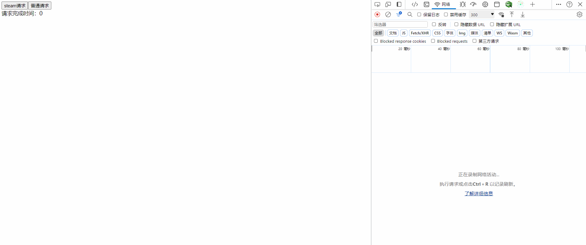

# stream-json-parse


> Return of large json against a web interface. Or at slow network speeds. Use stream-json-parse to parse json as it is downloaded. Allow the front-end to render part of the data in advance. Optimize user experience.
> Mainly use fetch streaming transfer, and generate features to achieve.

===================

example:
The data returned by the backend is as follows:

```js
{
  "code": 0,
  "data": [
    {
      "id": "64eb1b565c5214078f235c98",
      "email": "koch_pearson@isologics.global",
      "username": "koch90".

    },
    {
      "id": "64eb1b569f47412c27a74f11", {
      "email": "norma_roman@blanet.caravan",
      "username": "norma89",
    }, }
    ...
  ]
}

```

If there is a lot of data in the data, the front-end needs to wait for a long time to see the data. You can use stream-json-parse to parse the data as you download it. Let the front-end render part of the data in advance.
After using it, you can receive the data multiple times in the callback function. (The specific data received each time needs to be decided based on how much data is in each network packet)

```js
// Received in the first callback:
{
  "code": 0,
  "data": [
    {
      "id": "64eb1b565c5214078f235c98",
      "email": "koch_pearson@isologics.global",
      "username": "koch90".

    }
  ]
}
// Received in the second callback:
{
  "code": 0,
  "data": [
    {
      "id": "64eb1b565c5214078f235c98",
      "email": "koch_pearson@isologics.global",
      "username": "koch90".

    },
    {
      "id": "64eb1b569f47412c27a74f11", {
      "email": "norma_roman@blanet.caravan",
      "username": "norma89",
    }
  ]
}
```

===================

Usage:

``` js
import { createJsonParseWritableStream, arrayItemSymbol } from 'stream-json-parse'

const response = await fetch(
  './bigJson1.json',
  {
    method: 'GET'
  }
)
response.body
  // You need to use TextDecoderStream to decode into utf-8, otherwise you will get binary data directly
  .pipeThrough(new TextDecoderStream())
  .pipeTo(createJsonParseWritableStream({
    // Requires complete parsing of the data in the corresponding path for reporting (optional), arrayItemSymbol represents an array item
    completeItemPath: ['data', arrayItemSymbol],
    // Callback for json parsing
    jsonCallback: (error, isDone, value) => {
      console.log('jsonCallback', error, isDone, value)
    },
    diffCallBack: (json, isEq) => {
      console.log('diffCallBack', json, isEq)
    }
  })

```

Parameter description:

- `createJsonParseWritableStream`: The function creates a writable stream with the following parameters:
- `JSONParseOption`: Parsing configuration.
  - `protoAction?: 'error' | 'ignore' | 'preserve';` // Object contains forbidden prototype property.
  - `constructorAction?: 'error' | 'ignore' | 'preserve';` // Object contains forbidden constructor property
  - `strict?: boolean;` // Whether to use strict mode for the object, disallowing duplicate keys.
  - `completeItemPath?: (string|symbol)[]`, // Requires complete parsing of the data under the corresponding path to be reported. All that is required is an array of path keys, similar to `loadsh.get`. If the path is an array of items, the key is `arrayItemSymbol`, a Symbol that generalizes to all indexes in the array.
  - `updatePeriod?: number;` // The interval between updating the data (by executing the `jsonCallback` callback) after parsing a certain amount of data. Default 300ms.
  - `jsonCallback: (error: null | Error, done?: boolean, value?: any) => void;` // json parsing, each time after parsing a certain amount of data the callback is executed.
    - Callback parameters:
      - error: error message
      - done: if the parsing is done, the last data parsed.
      - value: the parsed data
  - `diffCallBack?: (data: any, isEq: boolean) => void;` // After json parsing is done, parse again with native JSON.parse to compare. If not written, no comparison is done. for debug.
    - Callback parameters:
      - json: the complete data parsed by the native parser
      - isEq: whether it is equal to the native parsed one, if not, the first json parameter should be used.

## demo effect:

Here I set my internet speed to 3Mb/s, it takes about 1s to download this json completely.

Ordinary request:



steam request:


As you can see with the normal request, the page waits until the json is fully loaded before it starts rendering the data. There is a long white screen.
With the steam request, the page parses as it goes down. The data is loaded gradually and there is almost no white screen time.

Note: If needed, you need to modify chrome developer tools, or other network tools, modify the network speed to slow3g, in order to see the effect.

demo can be viewed in the dev folder.

> Parsing logic borrowed from [json-bigint](https://github.com/sidorares/json-bigint)